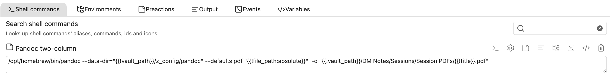

# Pandoc Filters and an Academic Workflow for Obsidian

> [!NOTE]
>
> - This workflow focuses on `markdown -> latex -> pdf`. There are many great plugins for other pipelines, such as [Obsidian Webpage Export](https://github.com/KosmosisDire/obsidian-webpage-export).
> - Basic knowledge of [pandoc](https://pandoc.org/), [YAML](https://yaml.org/), etc., is assumed.

## This repository includes

- A [workflow](#the-workflow) that helps you seamlessly convert your Obsidian notes to camera-ready PDFs
- [Pandoc filters](https://pandoc.org/lua-filters.html) that transform Obsidian Markdown for pandoc conversion
  - `callout.lua` transforms Obsidian callouts into LaTeX environments and color boxes with labeling support
  - `link.lua` transforms wikilinks into LaTeX references, supporting heading links and block links with alias
  - `codeblock.lua` parses codeblocks for plugins, including [TikZ](https://github.com/artisticat1/obsidian-tikzjax) and [Pseudocode](https://github.com/ytliu74/obsidian-pseudocode#use-in-block-preamble)
  - `image.lua` parses image captions and attributes, supporting Obsidian image alias
  - `shift_headings.lua` shifts heading levels to avoid duplicate H1 titles, supporting customizable shift levels
  - `div.lua` transforms custom pandoc divs
  - `preamble.lua` loads your reusable preamble file, e.g., `preamble.sty` for [obsidian-latex](https://github.com/wei2912/obsidian-latex)
  - `column_table.lua` makes a two-column page format play well with tables
- A [defaults file](https://pandoc.org/MANUAL.html#defaults-files) that configures all the pandoc options and meta variables
  - ❗ Please substitute the placeholders in the defaults file with your own configurations
- Some [templates](https://pandoc.org/MANUAL.html#templates) that control the look of the generated PDF

<!-- Please refer to the [customization guide](#customization-guide) for the detailed description of these files. -->

## Other recommended programs

- Obisidian plugin
  - [obsidian-shellcommands](https://github.com/Taitava/obsidian-shellcommands)

## The workflow

### 1. Configure pandoc files

1. Install [pandoc](https://pandoc.org/installing.html) and recommended programs that suit your needs.
2. Copy the three folders `filters`, `templates`, and `defaults` to the directory you choose, e.g., `obsidian_vault/config/pandoc/`.
3. Customize the `defaults/pdf.yaml` file to configure your pandoc options and replace the placeholders.

### 2. Write the note and frontmatter

When you compose the note, it is a good practice to keep the syntax simple and compatible with pandoc and other Markdown programs.
Add meta variables in the frontmatter ([properties](https://help.obsidian.md/Editing+and+formatting/Properties)) that you want pandoc and your template to pick up, e.g.,

```yaml
---
title: Obsidian Pandoc
author: Name
---
```

### 3. Setup the shell command

Now, you are ready to generate the PDF _outside_ Obsidian, by running the following shell command

```bash
pandoc --defaults obsidian_vault/config/pandoc/defaults/pdf.yaml note.md
```

There are many plugins that can help you run shell commands within Obsidian, e.g., [obsidian-shellcommands](https://github.com/Taitava/obsidian-shellcommands)
My obsidian-shellcommands command for creating a two-column session log looks like this:



